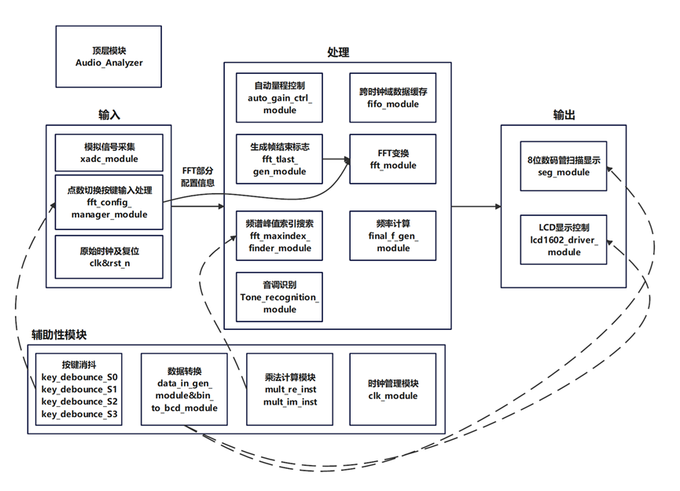
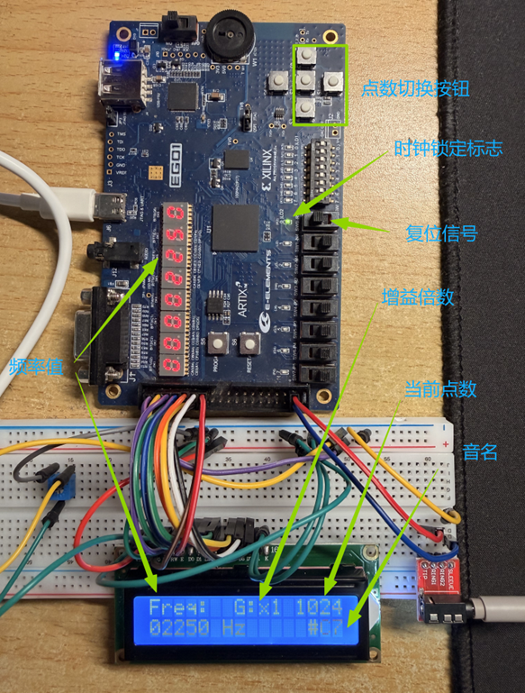

# 基于 FPGA 的实时音频频谱分析与音调识别系统
## 简介
本项目是一个基于 Xilinx Artix-7 系列 FPGA 的嵌入式系统，能够实时采集模拟音频信号，通过 FFT（快速傅里叶变换）算法分析频谱，并能够识别音乐音调（如 C4, #D5 等）。
## 硬件环境
1. FPGA: Xilinx Artix-7 系列 (如 XC7A35T)
2. ADC:内置 XADC 模块
3. 显示: LCD1602 液晶屏
4. 开发工具: Vivado 2018.3+
## 系统方案设计

1. 时钟管理模块 (clk_module)
硬件接口：连接外部100MHz晶振clk和复位按钮rst_n。
数据流：100MHz晶振 → MMCM生成三个时钟：100MHz(XADC采集)、150MHz(FFT处理)、50MHz(显示驱动)。
2. 模拟信号采集模块 (xadc_module)
硬件接口：连接3.5mm音频接口的vauxp2/vauxn2差分输入引脚。
数据流：模拟音频信号→12位ADC采样(48kHz)→数字输出do_out[15:0]及就绪信号drdy_out。
3. 自动量程控制模块（auto_gain_ctrl_module）
数据流：12位ADC采样数据→幅度检测→增益后ADC数据输出
4. 跨时钟域数据缓存模块 (fifo_module)
数据流：32位音频数据(位拓展后，100MHz时钟域) → 双端口RAM缓冲 → 跨时钟域同步 → 输出至FFT模块(150MHz时钟域)。
5. FFT按键配置管理模块 (fft_config_manager_module)
硬件接口：连接四个机械按键S0-S3，选择FFT点数(1024/512/256/128点)。
数据流：按键输入→消抖处理→配置参数生成→输出curr_nfft[4:0]和config_tdata[23:0]。
6. 按键消抖模块 (key_debounce) 
数据流：机械按键原始信号→消抖→边沿检测→单周期有效脉冲输出，消除接触抖动。
7. FFT生成帧结束模块 (fft_tlast_gen_module)
数据流：接收FFT点数配置curr_nfft→动态计数(0到N-1)→生成s_axis_data_tlast帧结束信号，标识每帧数据边界。
8. FFT变换模块 (fft_module)
数据流：时域数据流→可配置点数FFT变换→频域复数数据输出，支持128/256/512/1024点动态切换。
9. 频谱峰值索引搜索模块 (fft_maxindex_finder_module)
数据流：频域复数数据→计算能量值(实部²+虚部²)→搜索前N/2频点的最大值 → 输出峰值索引max_index[9:0]。
10. 频率计算模块 (final_f_gen_module)
数据流：峰值索引×采样率48000÷FFT点数→计算实际频率值final_freq_hz[15:0]。
11. 音调识别模块 (Tone_recognition_module)
数据流：频率数值→多级阈值比较→十二平均律映射→输出音名字符串note_name[23:0]，支持中高音调识别。
12. 显示数据转换模块 (data_in_gen_module)
数据流：32位频率数据→十进制分离(万、千、百、十、个位)→组合为8位BCD码data_in[31:0]，用于数码管显示。
13. BCD数据转换模块 (bin_to_bcd_module)
数据流：16位二进制频率→移位加3算法→转换得到5位BCD码(万、千、百、十、个位)，用于LCD显示。
14.  8位数码管扫描显示模块 (seg_module)
硬件接口：直接驱动8位共阴极数码管的seg1[7:0]、seg2[7:0]段选和digit[7:0]位选引脚。
数据流：BCD显示数据→1kHz动态扫描→7段译码→位选控制，利用视觉暂留实现稳定显示。
15. LCD显示控制模块 (lcd1602_driver_module)
硬件接口：驱动LCD1602的8位数据线lcd_db[7:0]和控制线lcd_rs、lcd_rw、lcd_e。
数据流：频率字符、FFT点数、音名字符→状态机控制→时序生成→LCD并行接口输出，显示两行信息。状态机框架：IDLE→初始化4状态(功能/显示/输入/清屏)→第一行显示("Freq:"+增益倍数+点数)→第二行显示(频率+音名)→返回IDLE循环刷新。
16. 系统顶层整合模块 (Audio_Analyzer)
硬件接口：集成所有外部物理接口：100MHz晶振clk、复位按钮rst_n、3.5mm音频接口vauxp2/vauxn2、四个配置按键S0-S3、8位数码管接口、LCD1602接口、MMCM锁定指示LED。
数据流：外部信号输入 → 时钟与复位分配 → 音频采集流水线 → FFT频谱分析 → 频率音调识别 → 双显示驱动输出，形成完整的音频信号实时分析系统。

## 项目展示

## 可继续进行完善的部分
1. 加入低频音调测量功能，使用更低的采样率与更高的FFT点数，增大频率分辨率，以区分频率相差小的音调。
2. 使用可展示更多细节的显示模块，如依靠HDMI在电脑端显示，以展示更多关于音频波形的细节

